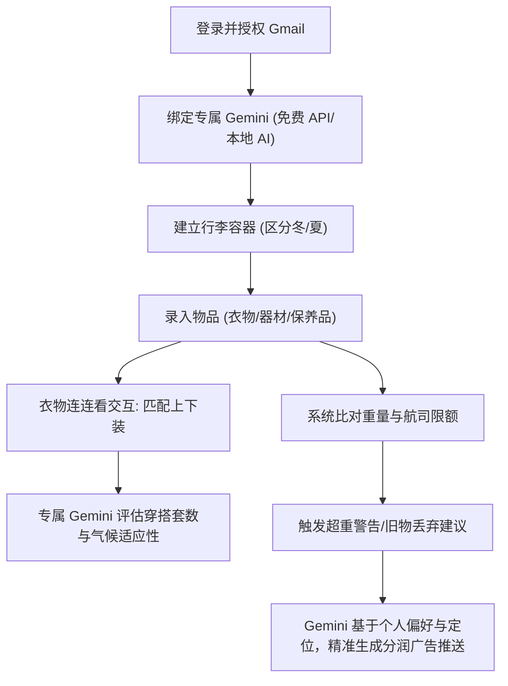

## 1. 产品概述
专为数字游牧民和长居海外人士打造的智能化行李与物品管理 Web App。
- 帮助用户精细化管理各个行李箱/袋（托运、手提、随身）中的物品及重量，追踪保养品的有效期限。
- 提供视觉化的“穿搭连连看”功能，智能计算衣物搭配方案；支持冬夏行李分类。
- **全新升级**：无缝接入用户自己的 **Gemini AI**（通过免费 API Key 或 Chrome 内置 AI），利用用户自身的 AI 额度进行 Gmail 航班解析、穿搭建议和全球分润好物（Dropshipping）的精准推荐，既能实现深度的个人化定制，又完美免除了平台的 AI Token 成本。

## 2. 核心功能

### 2.1 用户角色
| 角色 | 注册方式 | 核心权限 |
|------|---------------------|------------------|
| 游牧用户 | Google 账号登录 | 管理行李空间、使用连连看、配置专属 Gemini AI、接收极度个人化的减重与购物推荐 |

### 2.2 功能模块
1. **控制面板 (Dashboard)**：航班倒计时、重量概览、超重警告。结合用户的专属 Gemini AI 和定位（Geo-IP），推送高度个人化且符合当前国家场景的 Dropshipping 广告或旅居小物。
2. **专属 Gemini 接入 (Personalized AI)**：用户可直接在 App 内绑定个人的免费 Gemini API Key（或调用支持的浏览器本地 Gemini Nano）。AI 会结合用户长期录入的物品习惯，提供“比你更懂你”的打包和购物建议。
3. **空间与季节控管 (Luggage & Season Management)**：创建不同类型的行李包袋，支持一键区分“冬季”与“夏季”行李，精确管理容量与公斤数。
4. **视觉化穿搭 (Smart Outfit Combinations)**：
   - “连连看”交互：用户可视性地将“上衣”与“下装/裙子”连线。
   - Gemini 穿搭分析：调用专属 AI 根据所选连线，智能评估当前搭配是否适合目的地的气候。
5. **物品分类与管理 (Item Inventory)**：分类录入物品（衣物、器材、保养品）。记录重量、过期时间、新旧状态。
6. **航班规则提取**：结合 Gmail 授权与专属 Gemini，精准提取机票确认信中的行李限额规定。

### 2.3 页面详情
| 页面名称 | 模块名称 | 功能描述 |
|-----------|-------------|---------------------|
| 首页/控制面板 | 概览与 AI 推荐 | 航班倒数、重量环形图、**由专属 Gemini 生成的智能好物广告**推送（带分润链接） |
| 行李空间 | 季节与容器列表 | 顶部 Tab 切换冬/夏行李，展示行李箱卡片及重量分布 |
| 视觉穿搭 | 连连看画布 | 左右/上下分栏展示上下装，支持滑动连线，AI 辅助评估穿搭天数及场景 |
| 物品库 | 物品分类列表 | 标签过滤器、到期日提示、录入重量及新旧状态 |
| 个人设置 | AI 与授权 | Google 授权入口、**Gemini 免费 API 绑定设置**、分润链接偏好 |

## 3. 核心流程
用户使用 Google 登录后，系统引导填入免费的 Gemini API Key（或授权本地 AI）。接着同步 Gmail 航班、建立冬/夏行李容器。录入衣物时，在“视觉穿搭”面板连线匹配，专属 Gemini 将分析穿搭天数及合理性。当系统比对发现行李超重、旧物该丢弃，或到达新国家时，Gemini 会生成最懂用户的智能提示，并植入 Dropshipping 全球分润链接。

## 4. 用户界面设计
### 4.1 设计风格
- **主次色调**：大地色系（沙色、陶土色）搭配航空蓝，融入“时尚画报”的高级感，吸引注重穿搭的用户。
- **按钮与交互**：连连看采用 SVG 贝塞尔曲线连线动效；专属 Gemini 提示框采用类似 Chat 气泡的轻量拟人化设计。
- **字体与大小**：清晰无衬线字体（Inter）。
- **布局风格**：卡片式布局，画廊式（Gallery）衣物展示。

### 4.2 页面设计总览
| 页面名称 | 模块名称 | UI 元素 |
|-----------|-------------|-------------|
| 首页/控制面板 | AI 智能气泡 | 专属 Gemini 助理头像、个性化对话框、精致的分润商品卡片 |
| 视觉穿搭 | 连连看交互区 | 缩略图、动态连线、专属 Gemini 的穿搭点评 |
| 行李空间 | 容器列表 | 季节切换 Toggle、行李箱插画、容量环形图 |

### 4.3 响应式设计
移动端优先（Mobile-first）。“连连看”在手机端采用左右分列触控连线，平板和桌面端提供 Canvas 拖拽体验。
