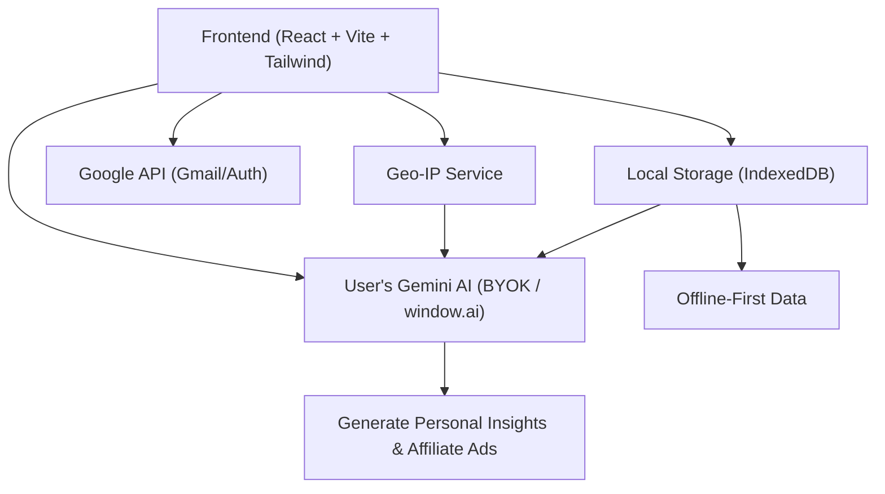
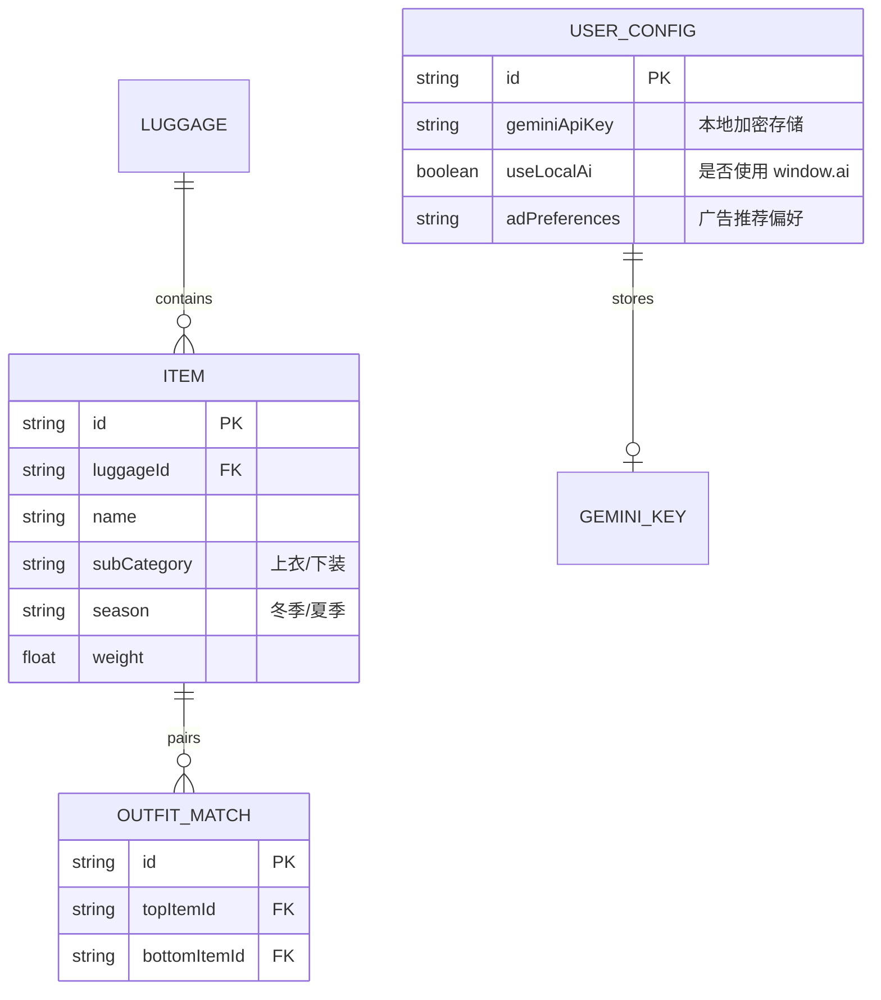

## 1. 架构设计

## 2. 技术说明
- **前端框架**：React@18 + TypeScript + Vite
- **样式方案**：Tailwind CSS + Framer Motion
- **状态管理与缓存**：Zustand + React Query
- **本地数据库**：Dexie.js（IndexedDB）
- **核心 AI 集成 (Zero Token Cost)**：
  - **Bring Your Own Key (BYOK)**：用户在设置中输入免费的 Google AI Studio Gemini API Key。系统将其加密储存在本地 IndexedDB 中。
  - **Chrome Built-in AI**：优先侦测浏览器是否支持 `window.ai` (Gemini Nano)，若支持则完全本地运行推理。
  - **Prompt Engineering**：将用户的物品清单、重量、即将前往的目的地打包为 Prompt 传给专属 Gemini，让 AI 充当“贴身行李管家”解析 Gmail 机票、点评连连看穿搭、并决定推送哪些 Dropshipping 产品。

## 3. 路由定义
| 路由 | 目的 |
|-------|---------|
| `/` | 着陆页与 Google 登录入口 |
| `/dashboard` | 控制面板（包含 Gemini 助理的对话框、重量概览、个性化广告） |
| `/luggages` | 行李箱列表管理（支持冬/夏季节切换） |
| `/outfits` | **穿搭连连看**：视觉交互区域，调用 Gemini 点评搭配 |
| `/items` | 物品总库 |
| `/settings` | **新增：AI 设置**（绑定 Gemini API Key 或开启本地 AI 选项） |

## 4. API 定义
纯客户端架构，无需自建后端：
- `GET /gmail/v1/users/me/messages`：获取邮件
- `POST https://generativelanguage.googleapis.com/v1beta/models/gemini-pro:generateContent?key={USER_KEY}`：使用用户配置的 Key 请求 Gemini，传入系统组装的 Context。
- `GET https://ipapi.co/json/`：获取用户地理位置
- 本地 DAO：
  - `ItemDAO`, `LuggageDAO`, `FlightDAO`, `OutfitDAO`
  - **新增** `ConfigDAO`：保存用户的 API Key 及个性化偏好。

## 5. 数据模型
### 5.1 数据模型定义

### 5.2 数据定义语言
- 新增 `user_configs` 表，安全存储 Gemini Key。
- AI 的生成结果（如：超重点评、购物推荐）不强制存储，每次基于当前 `items` 表的数据和 Geo-IP 状态动态生成并缓存至状态管理中。
